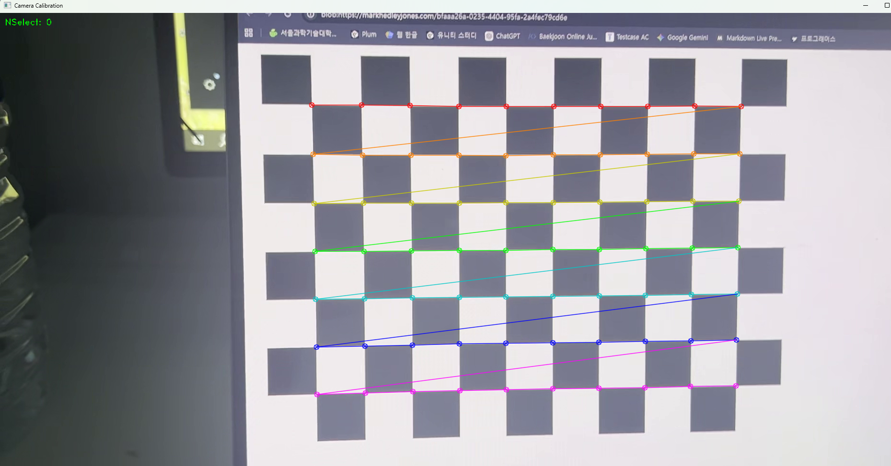
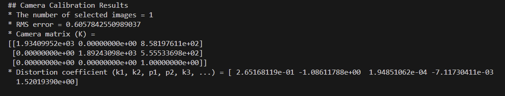
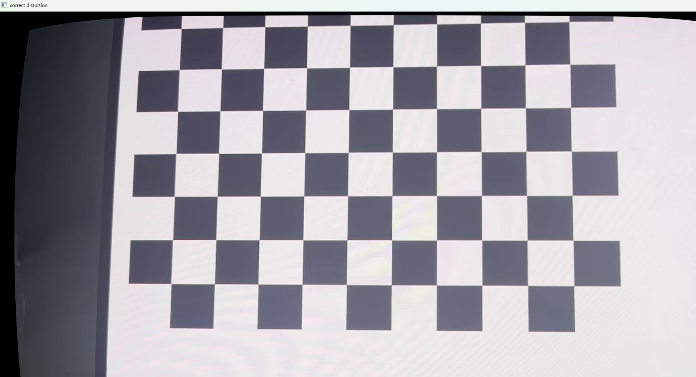

# DistortionCorrector
camera calibration and lens distortion correction using OpenCV

## 녹화된 비디오를 캘리브레이션한 후, 왜곡을 잡는 프로그램

녹화된 파일의 경로를 입력하고실행시키면 녹화된 영상이 재생

| 키 (Key) | 기능 설명 |
| :--- | :--- |
| **Space** | 영상 일시정지 및 체스판의 격자점을 찾아 표시 |
| **Enter** | 출력된 프레임을 저장 (저장된 프레임 개수는 좌측 상단에 표시) |

- Space를 사용했을 때 프레임

Enter키를 이용해 프레임을 저장한 이후에 동영상 재생이 종료되거나, ESC키를 눌러 창을 닫으면

- Enter이후 콘솔창
- K행렬, 왜곡 계수들과 RMS Error값이 출력됨

위와 같은 값들이 콘솔창에 출력됨과 동시에 왜곡을 수정한 영상이 출력되는 창이 띄워짐

- 왜곡 수정 후 스크린샷
